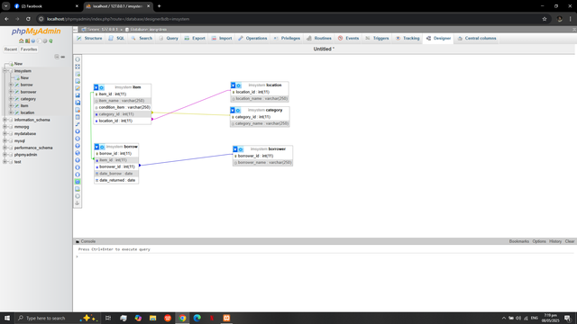
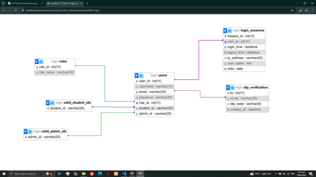

# Inventory Management System (IMS)

A web-based application designed for inventory tracking, borrowing management, and automated report generation. Built as a collaborative project for IT-2F.

## 🚀 Key Features
- **User Authentication:** Login/Logout with OTP verification and role assignment (Admin / Student).
- **Inventory Control:** Complete CRUD operations for items, categorized by location and item type.
- **Borrowing Engine:** Tracks borrowed/returned items, due dates, and borrower details.
- **Request & Damage Reporting:** Modules for item requests and damage/loss reports.

## 🛠️ Tech Stack
- **Backend:** PHP
- **Database:** MySQL / phpMyAdmin
- **Frontend:** HTML, CSS, JavaScript
- **Environment:** XAMPP (Apache / MySQL)

## 🗄️ Database Setup
1. Create a database named `imsystem` in phpMyAdmin (`http://localhost/phpmyadmin/`).
2. Import the `database/imsystem_schema.sql` file.
3. Configure `config/db_connect.php` with your database credentials.

## 🗄️ Database Architecture & Schema (ERD)

The system database is structured into core inventory tracking and authentication/session management entities:

### Inventory & Borrowing ERD

### User Authentication & Role ERD

